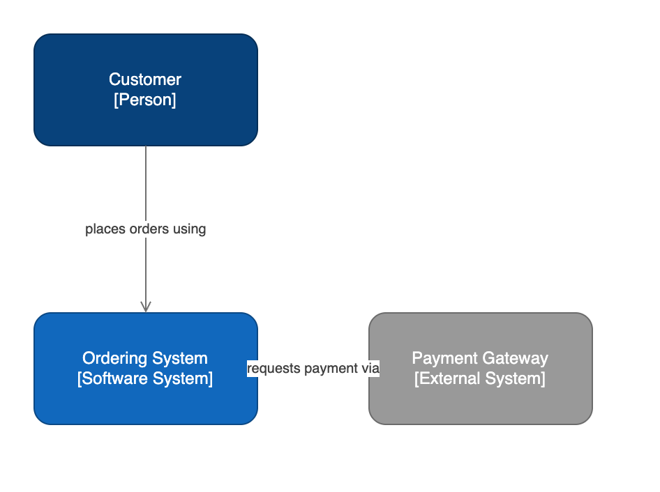
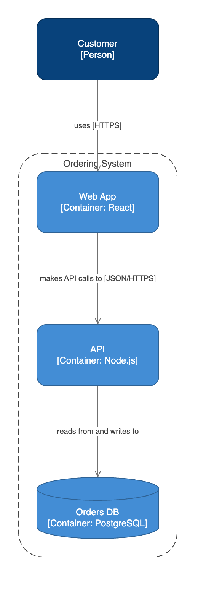
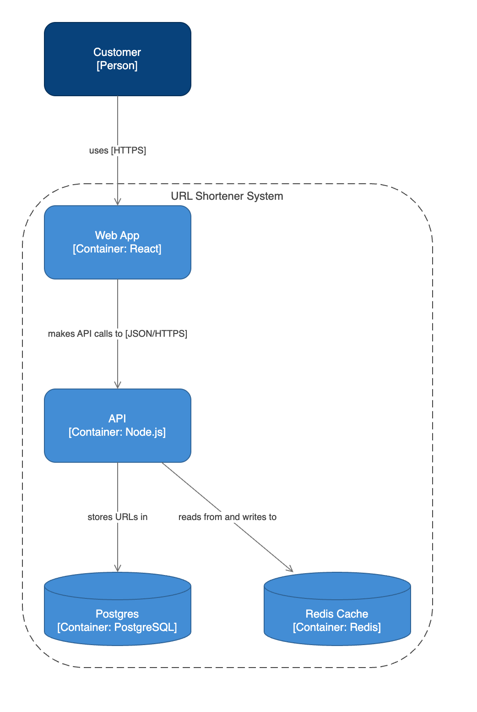

# drawio-architecture — Examples

Real prompts and the diagrams the skill produces. Each output is a native, editable
`.drawio` file (open it in [draw.io](https://app.diagrams.net) or the VS Code Draw.io
Integration extension); the PNG is a render of that file. All examples pass the skill's
own validator (structural + collision checks) and follow the C4 grid conventions.

> Previews are rendered with the official draw.io viewer via `scripts/render-examples.py`.

---

## 1. System Context

**Prompt**

> Draw a C4 system context diagram for an ordering system: a customer places orders using
> it, and it requests payment from an external payment gateway.

**Output** — [`examples/context.drawio`](examples/context.drawio)



A person, the software system in scope, and one external system, on the grid with every
relationship labeled with a verb.

---

## 2. Container view (with a boundary + datastore)

**Prompt**

> Draw a C4 container diagram for the ordering system: a customer uses a React web app that
> calls a Node.js API, which reads from and writes to a PostgreSQL orders database. Put the
> containers inside the system boundary.

**Output** — [`examples/container.drawio`](examples/container.drawio)



The web app, API, and database sit inside a dashed system boundary; the database uses the
cylinder datastore style; children follow the boundary-relative grid math.

---

## 3. Container view — URL shortener

**Prompt**

> A URL shortener: a user uses a web app, the web app calls an API, and the API uses a Redis
> cache and stores URLs in a Postgres database. Draw the C4 container diagram.

**Output** — [`examples/url-shortener.drawio`](examples/url-shortener.drawio)



Shows a two-column data tier (Redis cache + Postgres side by side) inside the boundary —
the multi-column boundary case from the conventions, produced by a fresh agent following
the skill end to end.

---

### Regenerating these previews

```bash
python3 scripts/render-examples.py          # builds viewer HTML under build/render/
# then screenshot each build/render/*.html (draw.io viewer) to examples/<name>.png
```
